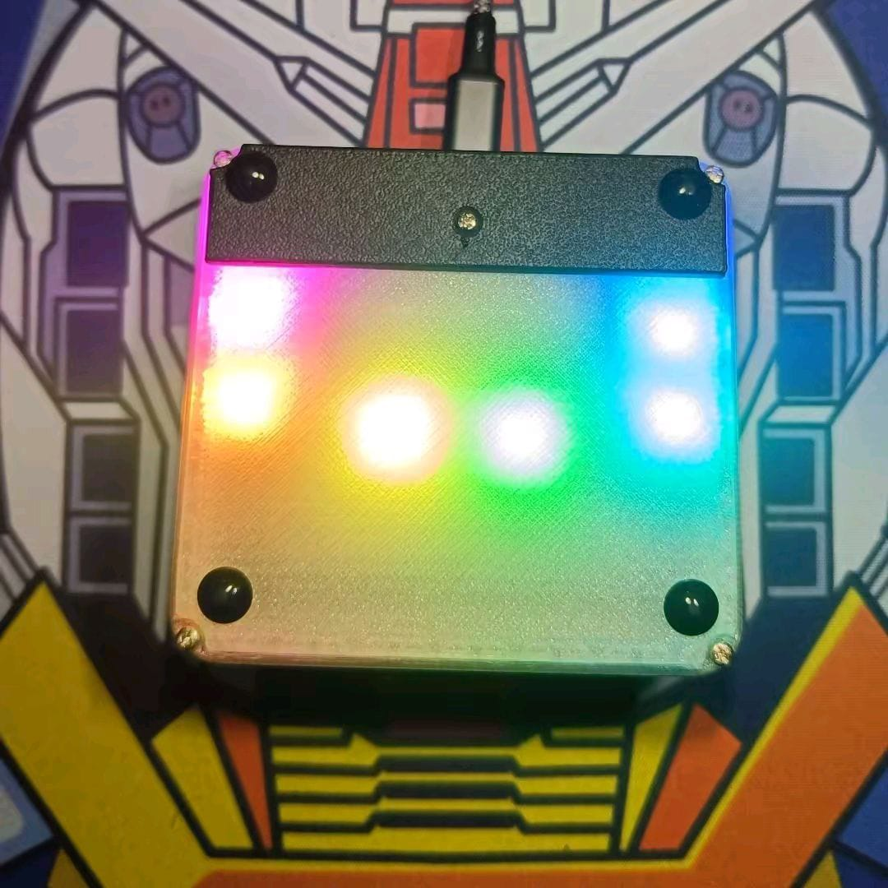

# Panduan OSUpad Clone VIA

Panduan ini berlaku untuk firmware rilis **OSUpad Clone VIA** pada STM32F103
clone. Firmware memakai USB STM32duino/libmaple yang telah diuji pada perangkat
ini; gunakan ST-Link untuk semua proses flash dan recovery.

## 1. Yang diperlukan

- OSUpad dan kabel USB-C data.
- ST-Link untuk flash atau recovery.
- Chrome atau Edge untuk [VIA Web](https://usevia.app).
- File `OSUpadCloneVIA.ino.bin` dan `via-definition.json` dari
  [halaman Releases](https://github.com/juarendra/OSUpad-QMK-VIA/releases/latest).

## 2. Flash firmware

1. Lepas USB OSUpad agar ST-Link menjadi satu-satunya sumber daya saat flash.
2. Hubungkan `SWDIO`, `SWCLK`, `GND`, dan hanya bila diperlukan `3.3V`.
3. Buka `OSUpadCloneVIA.ino.bin` pada STM32 ST-LINK Utility dengan alamat
   `0x08000000`, lalu pilih **Program & Verify**.
4. Lepas ST-Link dan hubungkan USB-C ke komputer.

BOOT0 tetap terhubung ke GND. Jangan mengubah BOOT1, Option Bytes, atau RDP.
Panduan rinci tersedia di
[FLASH_STLINK.md](../FIRMWARE/OSUpadCloneVIA/FLASH_STLINK.md).

## 3. Hubungkan dengan VIA

1. Buka [usevia.app](https://usevia.app).
2. Di **Settings**, aktifkan **Show Design Tab**.
3. Di **Design**, pilih **Load** dan buka `via-definition.json`.
4. Pastikan opsi **Use V2 definitions (deprecated)** tidak aktif.
5. Klik **Authorize device**, pilih **OSUpad Clone VIA**, lalu buka
   **Configure**.

JSON perlu dimuat karena OSUpad belum ada di database autodetect VIA. Setelah
dimuat pada browser tersebut, keymap dapat diubah langsung dan disimpan di
macropad.

## 4. Keymap dan layer

OSUpad memiliki enam posisi dan empat layer. Semua posisi bisa diganti lewat
VIA, termasuk keyboard biasa, shortcut kombinasi, media, mouse, RGB, dan aksi
layer.

| Layer | Keymap awal |
| --- | --- |
| 0 | `A`, `B`, `C`, `E`, `F`, `G` |
| 1 | `Q`, `W`, `X`, `Z`, `Y`, `U` |
| 2 | `QK_MACRO_0` sampai `QK_MACRO_5` |
| 3 | Arrow keys, `Space`, `Esc` |

Contoh Any Key yang berguna:

| Keycode | Fungsi |
| --- | --- |
| `LCTL(KC_C)` | Ctrl + C |
| `LALT(KC_TAB)` | Alt + Tab |
| `MO(1)` | Aktifkan Layer 1 selama tombol ditahan |
| `TG(1)` | Nyalakan/matikan Layer 1 |
| `PDF(1)` | Jadikan Layer 1 sebagai default dan simpan |
| `MS_BTN4` … `MS_BTN8` | Tombol mouse tambahan |
| `MS_WHLL` / `MS_WHLR` | Scroll horizontal |

## 5. Macro

VIA menyediakan 16 macro dengan kapasitas gabungan 512 byte. Setelah mengisi
macro, tempatkan `QK_MACRO_0` sampai `QK_MACRO_15` pada tombol yang diinginkan.

| Isi macro | Hasil |
| --- | --- |
| `halo` | Mengetik `halo` |
| `{KC_ENT}` | Enter |
| `{+KC_LCTL}{KC_C}{-KC_LCTL}` | Ctrl + C |
| `{250}` | Menunggu 250 ms |

Tunggu sekurangnya satu detik setelah mengubah macro agar data selesai
disimpan. Cabut-colok USB untuk memastikan macro tetap ada.

## 6. RGB, media, dan mouse

Halaman Lighting VIA dapat mengubah mode RGB, warna, brightness, saturation,
dan speed. Nilainya tersimpan di macropad. Mode yang tersedia mencakup static,
breathing, rainbow, swirl, snake, knight, Christmas, gradient, RGB test,
alternating, dan twinkle.

Melalui Any Key, OSUpad juga mendukung media/volume, browser controls, mouse
movement, scroll vertikal/horizontal, delapan tombol mouse, serta `KC_PWR`,
`KC_SLEP`, dan `KC_WAKE`. Uji keycode power/sleep pada komputer yang aman
karena sistem operasi dapat segera tidur atau mati.

## 7. Update dan recovery

Pembaruan normal dengan page erase mempertahankan keymap, macro, RGB, dan
default layer. **Mass Erase** menghapus seluruh flash termasuk data tersebut.
Jika USB tidak muncul, flash ulang binary rilis dengan ST-Link pada alamat
`0x08000000`; bootloader USB tidak diperlukan untuk recovery.

