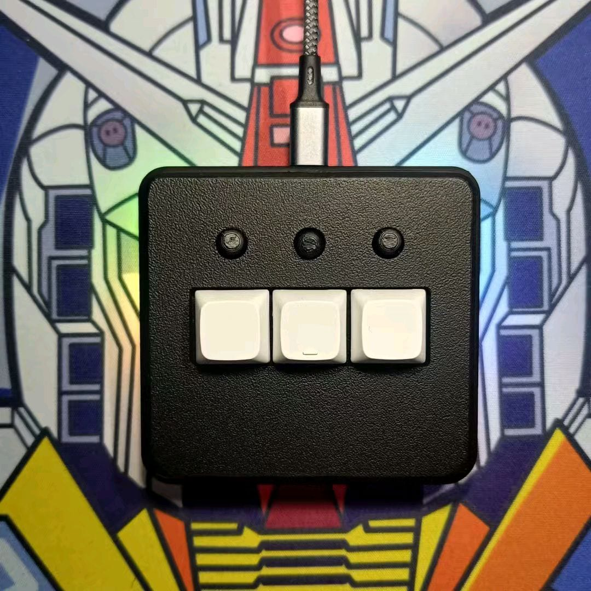

# OSUpad Clone VIA

**Macropad 6 tombol hotswap + tactile dengan RGB — konfigurasi tombol, layer,
macro, dan efek RGB lewat VIA, tanpa driver tambahan.**

oleh [Juarendra Ramadhani](https://github.com/juarendra)

[📦 Unduh Firmware](https://github.com/juarendra/OSUpad-QMK-VIA/releases/latest) |
[📖 Panduan Pengguna](DOC/PANDUAN_OSUPAD.md) |
[💻 Buka VIA](https://usevia.app) |
[🛠️ Hardware](HARDWARE)

---

Firmware alternatif berbasis Arduino (VIA-Arduino) untuk *clone* Macropad OSUpad 2x3. Ditujukan untuk *board clone* STM32F103 (dengan flash 32KB/64KB/256KB) yang jalur USB-nya tidak stabil ketika menggunakan firmware QMK/ChibiOS bawaan.

- **Protokol Stabil:** Menggunakan *USB stack* `STM32duino/libmaple` yang teruji stabil untuk clone STM32.
- **Auto-Detect VIA:** Menggunakan USB VID `0x7877` dan PID `0x1000` (sama dengan QMK). Memungkinkan *auto-detect* di aplikasi VIA jika *cache* definisi sudah ada di browser Anda.
- **Lighting Responsif:** Dukungan penuh tab Lighting di VIA V3 dengan efek `qmk_rgblight` dan optimasi *timing* bit-bang khusus untuk LED WS2812 di clock 72MHz.
- **Penyimpanan Aman:** Dual-page Flash Storage melindungi konfigurasi Anda dari kerusakan data jika USB tiba-tiba dicabut.

## Panduan Cepat

1. Unduh rilis `.bin` terbaru dan ikuti panduan **[Flash ST-Link](FIRMWARE/OSUpadCloneVIA/FLASH_STLINK.md)**.
2. Cabut ST-Link, colok kabel USB, lalu buka [usevia.app](https://usevia.app).
3. Jika *auto-detect* gagal, buka tab **Settings**, aktifkan **Show Design Tab**, lalu *load* `via-definition.json` yang ada di rilis. Pastikan opsi *Use V2 definitions* dinonaktifkan.
4. Jangan lupa baca **[Buku Panduan OSUpad](DOC/PANDUAN_OSUPAD.md)** untuk referensi layer dan kustomisasi.
