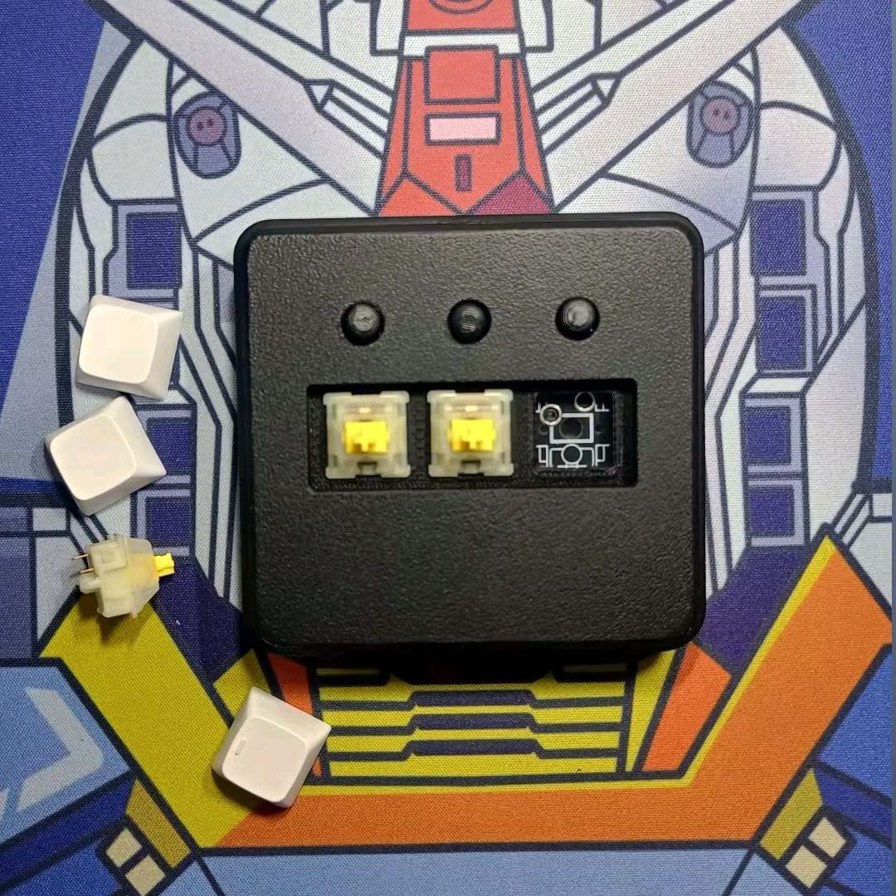
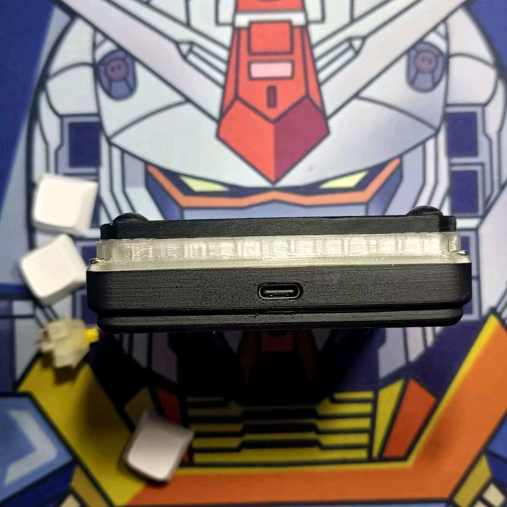

# OSUpad Clone VIA

**Macropad 6 tombol hotswap + tactile dengan RGB — konfigurasi tombol, layer,
macro, dan efek RGB lewat VIA, tanpa driver tambahan.**

oleh [Juarendra Ramadhani](https://github.com/juarendra)

[⬇️ Unduh Firmware](https://github.com/juarendra/OSUpad-QMK-VIA/releases/latest) ·
[📖 Panduan Pengguna](DOC/PANDUAN_OSUPAD.md) ·
[🎛️ Buka VIA](https://usevia.app) ·
[🔌 Hardware](HARDWARE)

---

## ✨ Fitur

| | |
| --- | --- |
| ⌨️ **6 tombol** | Tiga switch MX hotswap dan tiga tombol tactile; setiap posisi dapat dipetakan ulang. |
| 🧠 **4 layer × 16 macro** | Profil per aplikasi, macro QMK/VIA, dan default layer tersimpan di dalam macropad. |
| 🌈 **RGB 8 LED** | Warna, kecerahan, kecepatan, dan mode RGBLight dapat diatur dari VIA. |
| 🖱️ **Mouse + media** | Gerak mouse, delapan tombol mouse, scroll dua arah, media, browser, dan system control. |
| 🎛️ **VIA V3** | Keymap diubah langsung dari [usevia.app](https://usevia.app) lewat Raw HID. |
| 🔌 **STM32F103 clone · USB-C** | Firmware STM32duino/libmaple yang sudah diuji pada clone; pembaruan aman memakai ST-Link. |

## 🚀 Mulai dalam 3 langkah

1. **Flash sekali melalui ST-Link** — unduh `OSUpadCloneVIA.ino.bin` dari
   [Releases](https://github.com/juarendra/OSUpad-QMK-VIA/releases/latest)
   dan program pada alamat `0x08000000`.
2. **Colok USB-C** — perangkat muncul sebagai **OSUpad Clone VIA** tanpa
   driver khusus.
3. **Buka [usevia.app](https://usevia.app)** di Chrome atau Edge, muat JSON
   VIA sekali, lalu pilih tombol di layar untuk mengubah fungsinya.

> VIA belum tampil otomatis? Itu normal selama definisi belum masuk database
> VIA global. Ikuti [Load JSON file](#-via) di bawah; setelah dimuat, VIA dapat
> dipakai seperti keyboard VIA lainnya.

Panduan lengkap, macro, RGB, dan pemulihan: **[Panduan OSUpad](DOC/PANDUAN_OSUPAD.md)**.

## ⌨️ Keymap bawaan

Posisi 1–3 adalah grup pertama pada matrix (`PB0`, `PA7`, `PA6`); posisi 4–6
adalah grup kedua (`PB12`, `PB13`, `PB14`). Semua posisi dapat diubah dari VIA.

| Layer | Posisi 1 · 2 · 3 · 4 · 5 · 6 |
| --- | --- |
| **0** | `A` · `B` · `C` · `E` · `F` · `G` |
| **1** | `Q` · `W` · `X` · `Z` · `Y` · `U` |
| **2** | `QK_MACRO_0` … `QK_MACRO_5` |
| **3** | `←` · `↓` · `↑` · `→` · `Space` · `Esc` |

Layer 0 siap digunakan langsung; layer 1–3 adalah contoh yang aman untuk
diubah menjadi profil aplikasi, shortcut osu!, media, atau kontrol mouse.

## 📦 Firmware

**Unduh siap pakai:** [**Releases — versi terbaru**](https://github.com/juarendra/OSUpad-QMK-VIA/releases/latest)

| File rilis | Untuk |
| --- | --- |
| `OSUpadCloneVIA.ino.bin` | ✅ **STM32F103 clone** — firmware VIA lengkap, flash dengan ST-Link pada `0x08000000`. |
| `via-definition.json` | Definisi VIA V3 yang dimuat melalui tab **Design**. |
| `SHA256SUMS.txt` | Verifikasi integritas file rilis. |
| `FLASH_STLINK.md` | Panduan flash, pembaruan, dan recovery. |

<b>Cara flash dengan ST-Link</b>

1. Lepas kabel USB OSUpad. Hubungkan `SWDIO`, `SWCLK`, `GND`, dan bila perlu
   `3.3V` dari ST-Link. `NRST` tidak wajib.
2. Di STM32 ST-LINK Utility pilih **File → Open file**, buka
   `OSUpadCloneVIA.ino.bin`, lalu isi alamat awal `0x08000000`.
3. Pilih **Target → Program & Verify**, lepas ST-Link, lalu colok USB-C.

`BOOT0` tetap ke GND; tidak perlu memasuki mode bootloader. Jangan mengubah
Option Bytes atau Read Out Protection. Lihat panduan lengkap
[FLASH_STLINK.md](FIRMWARE/OSUpadCloneVIA/FLASH_STLINK.md).

<b>Build dari source</b>

Source rilis ada di [`FIRMWARE/OSUpadCloneVIA/`](FIRMWARE/OSUpadCloneVIA).
Build menggunakan board **Generic STM32F103C6/fake STM32F103C8**, upload
method **STLink**, CPU **72 MHz**, STM32duino F1 `2022.9.26`, dan library
USBComposite `1.0.8`. Konfigurasi persisnya ada di
[GitHub Actions](.github/workflows/build-osupad-clone-via.yml); setiap
perubahan firmware diperiksa dan dibuild otomatis.

## 🎛️ VIA

### Load JSON file

Definisi OSUpad belum terdaftar di database VIA global, sehingga JSON perlu
dimuat secara manual sekali pada browser atau aplikasi VIA yang dipakai:

1. Colok OSUpad dan buka [usevia.app](https://usevia.app) di Chrome/Edge.
2. **Settings** → aktifkan **Show Design Tab**.
3. Buka tab **Design** → **Load**, lalu pilih
   [`via-definition.json`](FIRMWARE/OSUpadCloneVIA/via-definition.json).
4. Pastikan **Use V2 definitions (deprecated)** tetap **nonaktif**.
5. Klik **Authorize device**, pilih **OSUpad Clone VIA**, kemudian buka tab
   **Configure**.

Jika perangkat tidak menjawab, cabut-colok USB lalu ulangi dari langkah 3.
Firmware dan JSON harus berasal dari rilis yang sama.

### Macro, layer, dan Any Key

VIA menyediakan 16 macro dengan total 512 byte. Tulis teks biasa, atau gunakan
format send-string QMK berikut di editor macro:

| Isi macro | Hasil |
| --- | --- |
| `macro-test` | Mengetik `macro-test` |
| `{KC_ENT}` | Menekan Enter |
| `{+KC_LCTL}{KC_C}{-KC_LCTL}` | Ctrl + C |
| `{300}` | Jeda 300 ms |
| `QK_MACRO_0` … `QK_MACRO_15` | Menjalankan macro 0–15 dari tombol yang dipilih |
| `MO(1)`, `TG(1)`, `TO(2)`, `PDF(1)` | Aksi layer QMK |

Fitur **Any Key** juga mendukung keycode mouse, consumer/media, dan RGB yang
didukung firmware. Setelah menyimpan keymap, macro, atau RGB, tunggu sekitar
satu detik sebelum melepas USB agar perubahan selesai ditulis ke flash.

## 🌈 RGB

Delapan LED WS2812 dikendalikan dari halaman Lighting VIA. Tersedia static,
breathing, rainbow, swirl, snake, knight, Christmas, gradient, RGB test,
alternating, dan twinkle. Kontrol hue, saturation, brightness, speed, serta
mode juga bisa dipetakan ke tombol melalui Any Key.

## 🛠️ Hardware

- [Dimensi OSUpad (PDF)](HARDWARE/OSU_Dimension.pdf) ·
  [Model 3D STEP](HARDWARE/3D%20MODEL/1.OSU%20Macropad%20v19.step)
- [Case 3D-printable](HARDWARE/Case) — top, bottom, dan kaki.
- [PCB schematic dan board](HARDWARE/PCB/osu_macropad) ·
  [PDF PCB](HARDWARE/osu_macropad.pdf)
- [Foto hardware](DOC/HARDWARE) dan [panduan pengguna](DOC/PANDUAN_OSUPAD.md)

## 🗺️ Status kompatibilitas

| Tahap | Status |
| --- | --- |
| Firmware Clone VIA + persistence | ✅ rilis dan diuji pada perangkat |
| GitHub Actions build + batas flash aman | ✅ aktif |
| VIA V3 melalui sideload JSON | ✅ aktif |
| VIA autodetect global | ⏳ perlu pendaftaran definisi ke database VIA |
| QMK USB/ChibiOS pada clone ini | ❌ tidak dipakai; gunakan firmware Clone VIA |

## 🆘 Recovery singkat

Jika USB gagal terdeteksi setelah pembaruan, hubungkan ST-Link dan flash ulang
binary rilis pada `0x08000000`. Recovery tidak bergantung pada bootloader USB.
**Mass Erase** akan menghapus keymap, macro, dan RGB tersimpan; gunakan hanya
bila memang ingin reset penuh.

Dibuat dengan ☕ oleh <b>Juarendra Ramadhani</b> · Indonesia

